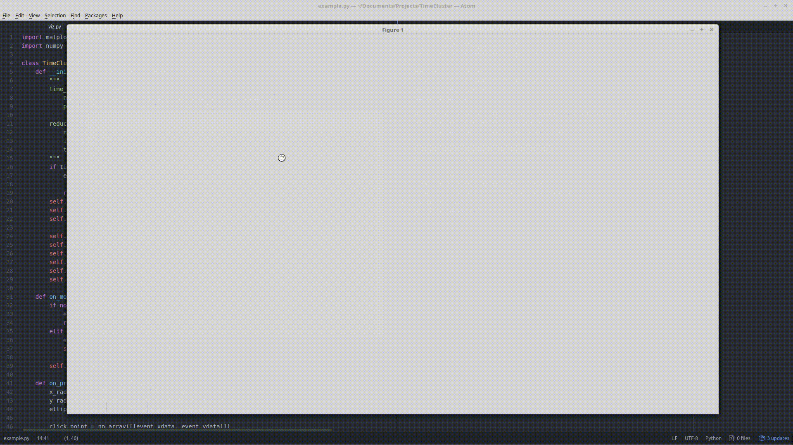

# TimeCluster

Based on the [TimeCluster paper](https://link.springer.com/article/10.1007/s00371-019-01673-y) by Ali et al.,where they showed this incredibly useful visualization technique for finding
interesting patterns in time series.
This is a simple implementation using Matplotlib and Numpy, currently only set-up
to work with univariate time series.

There is still a long road towards making this feature complete. Primarily I think
that it would be useful to be able to run this in a Jupyter Notebook. Then adding
support for multivariate time series.

Contributions are welcome.

# Workflow
The general idea for this workflow is to provide you with the visualization and
highlighting tools. The entry point is through `viz.TimeCluster`.

The `TimeCluster`
class inits with a time series and the dimensionality reduction you wish to plot.
This means that you can use any reduction technique you want, so long as the
order of the points is the same in both arrays. After initialization, you can
call `TimeCluster.start_viz()` to bring up the Matplotlib window. This will
block code execution (as is normal for Matplotlib) until the window is closed.

In the window:
 - Double clicking on the bottom plot highlights points
 - `n` increases the color number, `m` decreases it. These are also the labels attached to a color.
 - `,` increases the brush size, `.` decreases it. Currently there are only 3 brush sizes. The sizes correspond to what percentage of the screen they cover. A brush with
 size 0.1 covers 10% of the screen (10% in the x, 10% in the y).

 After closing the window, you'll still have access to the `TimeCluster` object
 and can extract the labels, `TimeCluster.label_mask`.
